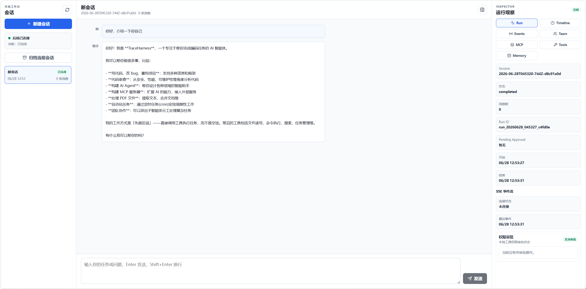
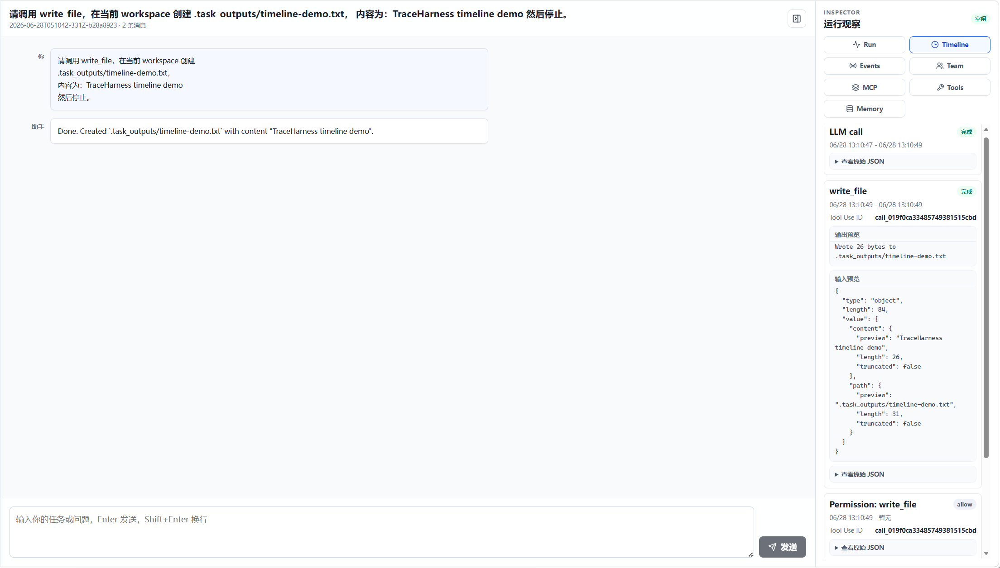
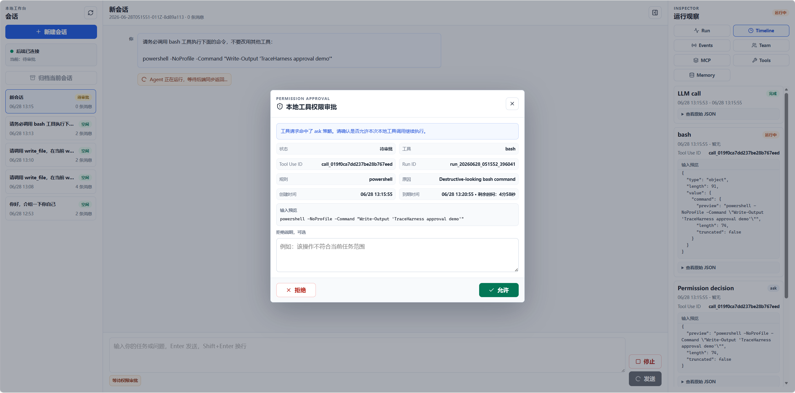

# TraceHarness

TraceHarness 是一个本地运行、透明、可审计的 Coding Agent Harness。它围绕一个可读的 Agent Loop，将模型调用、工具执行、权限审批、运行事件、会话持久化、Memory、MCP、多 Agent 协作和 Git worktree 隔离组织在同一套运行时中。

项目后端使用 Python 与 FastAPI，前端使用 React、TypeScript 和 Vite。CLI 与 WebUI 共享同一套 Agent Runtime：既可以通过 `python main.py` 在终端中使用，也可以通过浏览器工作台管理会话、观察运行过程并处理工具审批。

TraceHarness 主要提供：

- Python Coding Agent CLI。
- React + FastAPI 本地 WebUI。
- 基于工具调用的 Agent Runtime。
- SSE 实时运行事件流。
- 可配置的工具权限审批。
- 本地 Session、Run、Audit Event 和 Memory 持久化。
- Anthropic 与 OpenAI-compatible 模型接入。
- stdio MCP server 与动态工具注册。
- Subagent、Teammate、Task 和 Git worktree 协作能力。

## 项目亮点

### 1. 保持可读的 Agent Harness

TraceHarness 保留了 Coding Agent 最核心的执行闭环：

```text
用户输入
  -> 组装上下文
  -> 调用模型
  -> 解析 tool use
  -> 执行工具
  -> 返回 tool result
  -> 继续调用模型
  -> 输出最终结果
```

Agent Loop、模型 Provider、工具注册、持久化和交互入口被拆分为独立模块，便于理解一次请求如何进入模型、触发工具并形成最终响应。

### 2. 透明、可审计的运行过程

运行时会将关键行为记录为 workspace-local JSONL event：

- 用户任务提交。
- LLM 调用开始、完成和失败。
- 工具调用开始、完成和失败。
- 权限判断和用户审批结果。
- Session、Run 和后台任务状态变化。
- MCP 连接和工具注册结果。
- Memory 写入。
- Teammate 消息和协作事件。

WebUI 会将这些事件投影为 Run 状态、Timeline 和 Events 视图，使模型调用、工具执行和状态变化不再隐藏在黑盒中。

### 3. Human in Loop 的工具审批

TraceHarness 在工具真正执行前应用可配置策略：

- `allow`：直接执行。
- `ask`：等待用户确认。
- `deny`：拒绝执行并将结果返回 Agent。

CLI 使用终端确认，WebUI 使用非阻塞审批面板和弹窗。审批状态与 Session、Run、Tool Use ID 关联，并写入审计事件。

### 4. CLI 与 WebUI 共用同一 Runtime

CLI 和 FastAPI Web 后端不会维护两套 Agent 实现。二者共同复用：

- Agent Loop。
- Provider router。
- Tool registry。
- Context compaction。
- Permission policy。
- Session、Memory 和 Event persistence。
- Task、Team、Worktree 和 MCP 能力。

`coding_agent.agent_loop` 保留兼容入口，实际运行模块位于 `coding_agent.runtime`。

### 5. Workspace-local 持久化

项目不依赖数据库。Session、Run、Audit Event、Memory、Task、Mailbox 和调度任务均写入当前 workspace 内的文件。

这些数据格式以 JSON、JSONL 和 Markdown 为主，便于直接检查、备份和清理，也便于 WebUI 在不引入额外基础设施的情况下恢复会话与运行状态。

### 6. Provider 解耦与故障恢复

模型调用通过统一 Provider interface 进入运行时：

- Anthropic Provider。
- OpenAI-compatible Chat Completions Provider。
- 同一 Provider 内的 fallback model。
- 请求重试、超时和 overloaded/529 恢复。

Agent Loop、上下文压缩、Subagent 和 Teammate 均通过 Provider router 调用模型。

### 7. 上下文、Memory 与 Skills

TraceHarness 对长会话提供多层上下文处理：

- 对历史消息进行压缩。
- 限制和裁剪大型 tool result。
- 将大型工具输出持久化到本地文件。
- 将长期 Memory 注入系统上下文。
- 扫描并按需加载 `skills/*/SKILL.md`。
- 将内部 reminder、compaction 和 tool result 与用户可见消息分离。

### 8. MCP 动态扩展

项目支持配置 workspace-local stdio MCP server。连接后会：

1. 启动本地 MCP 子进程。
2. 完成 JSON-RPC initialize。
3. 发现 server 暴露的工具。
4. 将工具以 `mcp__{server}__{tool}` 命名加入当前工具池。
5. 检测规范化后的工具名冲突，避免静默覆盖。

项目还包含 `docs` 和 `deploy` 两个内置 mock MCP server，用于演示连接、发现和审批流程。

### 9. 多 Agent 与 Worktree 协作

TraceHarness 提供两类本地 Agent 协作方式：

- **Subagent**：一次性执行聚焦任务，并将最终结果返回主 Agent。
- **Teammate**：后台线程运行，通过 JSONL mailbox 与 Lead 通信。

Task system 支持任务依赖、认领、完成、owner 和 worktree binding。Git worktree 工具可为任务创建隔离工作目录，使 Teammate 的文件操作在绑定的 worktree 中执行。

### 10. 后台任务与调度

耗时工具可以在后台线程执行，并在完成后将结果重新注入 Agent 上下文。Cron scheduler 支持五段 cron 表达式、一次性或重复任务，以及可选的本地持久化。

Web Run 同时支持后台执行、状态查询、取消、审批等待和服务重启后的中断状态恢复。

## WebUI

WebUI 是 TraceHarness 的本地运行工作台，由会话区、对话区和 Inspector 组成。

### 会话与对话

- 新建、选择、继续和归档本地 Session。
- 展示用户可见的对话历史。
- 启动后台 Run。
- 取消正在执行或等待审批的 Run。
- 根据最终 Session snapshot 同步对话结果。

### 实时运行观察

- 通过 SSE 订阅当前 Run 的事件流。
- 断线后按事件 ID 回放已有事件。
- 展示 Run 状态、开始时间、结束时间和待审批操作。
- 将 LLM、Tool、Permission、MCP 和 Memory 事件展示为 Timeline。

### Inspector

Inspector 包含以下面板：

- **Run**：当前 Session、Run 和 SSE 状态。
- **Timeline**：按时间展示模型与工具活动。
- **Events**：查看和筛选原始审计事件。
- **Team**：查看 Teammate、Task 和 Worktree 状态。
- **MCP**：查看、连接 MCP server 及其工具。
- **Tools**：查看内置工具和 MCP 工具 metadata。
- **Memory**：读取并追加 `.memory/MEMORY.md`。

### 权限审批

当工具策略返回 `ask` 时，WebUI 会显示待审批操作。用户可以查看工具名、输入预览和策略原因，然后允许或拒绝该次调用。

### 工作台总览



### Timeline 与运行事件



### 权限审批



## 技术栈

| 层级 | 技术 |
| --- | --- |
| Agent Runtime | Python 3.10+ |
| Web API | FastAPI、Uvicorn |
| Model Provider | Anthropic SDK、OpenAI-compatible Chat Completions |
| Frontend | React 18、TypeScript、Vite |
| 实时事件 | Server-Sent Events |
| 本地存储 | JSON、JSONL、Markdown |
| 配置 | dotenv、YAML、JSON |
| 并发 | Python threads、ContextVar、threading events |
| 代码隔离 | Git worktree |
| MCP | stdio、JSON-RPC |
| Python 测试 | pytest、HTTPX TestClient |
| Frontend 测试 | Vitest、Testing Library、jsdom |

## 内置工具与本地能力

### 基础工具

| 工具 | 作用 |
| --- | --- |
| `bash` | 在当前 workspace 或绑定 worktree 中执行 shell 命令 |
| `read_file` | 读取 workspace 内文件 |
| `write_file` | 写入 workspace 内文件 |
| `edit_file` | 对文件执行一次精确文本替换 |
| `glob` | 按 glob pattern 查找文件 |
| `todo_write` | 维护当前进程内的任务列表 |
| `compact` | 压缩当前会话上下文 |

### Context、Memory 与 Skills

| 工具 | 作用 |
| --- | --- |
| `load_skill` | 按名称加载 `skills/*/SKILL.md` |
| `memory_read` | 读取 workspace 固定 Memory 文件 |
| `memory_append` | 向 `.memory/MEMORY.md` 追加内容 |

### Subagent 与 Team

| 工具 | 作用 |
| --- | --- |
| `task` | 启动一次性 Subagent |
| `spawn_teammate` | 启动后台 Teammate |
| `send_message` | 向 Teammate 发送 mailbox 消息 |
| `check_inbox` | 读取 Lead inbox |
| `team_status` | 查看 Teammate、请求、Task 和 Worktree 状态 |
| `request_plan` | 请求 Teammate 提交计划 |
| `review_plan` | 接受或拒绝 Teammate 计划 |
| `request_shutdown` | 请求 Teammate 停止 |

### Task 与 Worktree

| 工具 | 作用 |
| --- | --- |
| `create_task` | 创建本地 Task |
| `list_tasks` | 列出 Task |
| `get_task` | 读取 Task 详情 |
| `claim_task` | 认领可执行 Task |
| `complete_task` | 完成已认领 Task |
| `create_worktree` | 创建并可选绑定 Task 的 Git worktree |
| `keep_worktree` | 保留 worktree 供人工检查 |
| `remove_worktree` | 在满足安全条件时移除 worktree |

### Cron 与 MCP

| 工具 | 作用 |
| --- | --- |
| `schedule_cron` | 创建调度任务 |
| `list_crons` | 查看调度任务 |
| `cancel_cron` | 取消调度任务 |
| `connect_mcp` | 连接 mock 或配置的 stdio MCP server |

连接 MCP server 后，服务端发现的工具会动态加入工具池。

## 项目结构

```text
TraceHarness/
├─ main.py                         # CLI 入口
├─ coding_agent/
│  ├─ agent_loop.py                # 向后兼容入口
│  ├─ runtime/                     # Agent Loop、CLI、LLM、事件、会话与取消
│  ├─ providers/                   # Anthropic 与 OpenAI-compatible Provider
│  ├─ tools/                       # 工具实现、注册表与 Subagent
│  ├─ security/                    # 权限策略与审计
│  ├─ web/                         # FastAPI、AgentService、SSE、审批与状态服务
│  ├─ mcp/                         # MCP 配置、客户端与 stdio transport
│  ├─ memory/                      # Memory store、上下文与 Skill loader
│  ├─ task_system/                 # Task graph 与 Git worktree
│  ├─ teams.py                     # Teammate、mailbox 与协作协议
│  ├─ background.py                # 后台工具任务
│  ├─ cron_scheduler.py            # Cron scheduler
│  └─ context_compaction.py        # 上下文压缩与大型输出持久化
├─ webui/
│  ├─ src/                         # React WebUI
│  ├─ package.json
│  └─ vite.config.ts
├─ skills/                         # 可按需加载的本地 Skills
├─ tests/                          # Python 回归测试
├─ .env.example                    # 模型配置示例
├─ .agent_policy.example.yaml      # 权限策略示例
├─ requirements.txt
└─ requirements-dev.txt
```

## 本地数据目录

TraceHarness 主要通过 workspace 内文件保存状态。

| 路径 | 内容 |
| --- | --- |
| `.agent_events/events.jsonl` | Runtime audit event |
| `.agent_sessions/*.json` | Session metadata、模型上下文和用户可见消息 |
| `.agent_sessions/archive/` | 已归档 Session |
| `.agent_runs/*.json` | Web Run 状态 |
| `.memory/MEMORY.md` | Workspace 长期 Memory |
| `.tasks/*.json` | Task graph |
| `.worktrees/` | Git worktree 与相关状态 |
| `.mailboxes/*.jsonl` | Teammate mailbox |
| `.transcripts/` | Context compaction transcript |
| `.task_outputs/tool-results/` | 大型工具输出 |
| `.scheduled_tasks.json` | 持久化 Cron job |

这些路径已在 `.gitignore` 中排除。

## 快速开始

### 环境要求

- Python 3.10 或更高版本。
- Node.js `20.19+` 或 `22.12+`。
- Git。使用 Worktree 功能时，当前 workspace 必须是 Git repository。
- 一个可用的 Anthropic 或 OpenAI-compatible 模型服务。

### 1. 获取项目

```powershell
git clone https://github.com/Xueyifan912/TraceHarness.git
cd TraceHarness
```

### 2. 创建 Python 虚拟环境

PowerShell：

```powershell
python -m venv .venv
.\.venv\Scripts\Activate.ps1
```

macOS 或 Linux：

```bash
python3 -m venv .venv
source .venv/bin/activate
```

### 3. 安装 Python 依赖

```powershell
python -m pip install -r requirements.txt
```

### 4. 配置模型

PowerShell：

```powershell
Copy-Item .env.example .env
```

macOS 或 Linux：

```bash
cp .env.example .env
```

编辑 `.env`，至少填写模型 ID 和对应 Provider 的 API key。

Anthropic 示例：

```dotenv
MODEL_PROVIDER=anthropic
MODEL_ID=your-model-id
ANTHROPIC_API_KEY=your-api-key
```

OpenAI-compatible 示例：

```dotenv
MODEL_PROVIDER=openai-compatible
MODEL_ID=your-model-id
OPENAI_COMPATIBLE_BASE_URL=https://example.com/v1
OPENAI_COMPATIBLE_API_KEY=your-api-key
```

### 5. 启动 CLI

```powershell
python main.py
```

输入任务并按 Enter 发送，输入 `q` 或 `exit` 退出。

### 6. 启动 Web 后端

```powershell
python -m uvicorn coding_agent.web.app:app --host 127.0.0.1 --port 8765
```

### 7. 安装并启动 WebUI

另开一个终端：

```powershell
npm --prefix webui ci
npm --prefix webui run dev
```

访问：

```text
http://127.0.0.1:5173
```

Vite dev server 默认将 `/api` 转发到 `http://127.0.0.1:8765`。

## 配置说明

### 模型配置

| 环境变量 | 必需 | 说明 |
| --- | --- | --- |
| `MODEL_PROVIDER` | 否 | `anthropic` 或 `openai-compatible`，默认 `anthropic` |
| `MODEL_ID` | 是 | 主模型 ID |
| `ANTHROPIC_API_KEY` | Anthropic 必需 | Anthropic Provider API key |
| `ANTHROPIC_BASE_URL` | 否 | 自定义 Anthropic-compatible endpoint |
| `OPENAI_COMPATIBLE_BASE_URL` | OpenAI-compatible 必需 | Chat Completions base URL |
| `OPENAI_COMPATIBLE_API_KEY` | OpenAI-compatible 必需 | API key |
| `FALLBACK_MODEL_ID` | 否 | 同一 Provider 的 fallback model |
| `REQUEST_TIMEOUT_SECONDS` | 否 | 模型与 MCP 请求超时，默认 `60` 秒 |

完整模板见 `.env.example`。

### 权限策略

将 `.agent_policy.example.yaml` 复制为 `.agent_policy.yaml` 后，可以覆盖或扩展默认策略：

```yaml
bash:
  default_action: ask
  extend_deny_patterns:
    - "curl http://untrusted.example/install.sh | sh"
  extend_ask_patterns:
    - "git push --force"

file_tools:
  guarded_tools:
    - write_file
    - edit_file

mcp:
  ask_name_patterns:
    - deploy
```

### MCP 配置

TraceHarness 会按顺序读取 `.mcp.json` 或 `.agent_mcp.yaml`。JSON 示例：

```json
{
  "servers": {
    "local-tools": {
      "command": "python",
      "args": ["path/to/mcp_server.py"],
      "env": {
        "EXAMPLE_VARIABLE": "value"
      }
    }
  }
}
```

配置完成后，可以通过 Agent 的 `connect_mcp` 工具或 WebUI MCP 面板连接 server。

## 参考与致谢

TraceHarness 在以下开源项目公开的设计思路基础上进行学习和工程化实践：

- [learn-claude-code](https://github.com/shareAI-lab/learn-claude-code)：最小 Coding Agent Harness、tool use 与 tool result 执行闭环。
- [CyberClaw](https://github.com/ttguy0707/CyberClaw)：透明执行、审计事件与安全策略方向。
- [nanobot](https://github.com/HKUDS/nanobot)：轻量 Agent Runtime、Provider 解耦、Memory、MCP、调度和 Web Workbench 方向。

TraceHarness 与上述项目不存在兼容性承诺；功能和行为以本仓库当前实现为准。

## 参与贡献

欢迎通过 Issue 提交问题、使用反馈和范围明确的改进建议，也欢迎提交保持现有模块边界和本地运行定位的 Pull Request。

## 许可证

本项目采用 [MIT License](LICENSE)。
